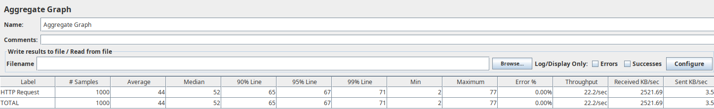
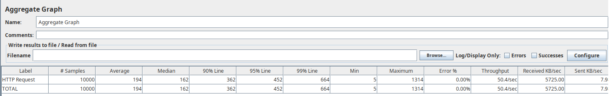
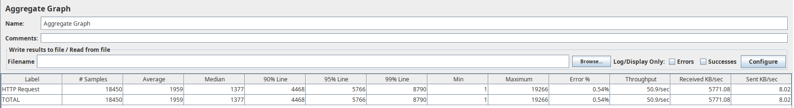
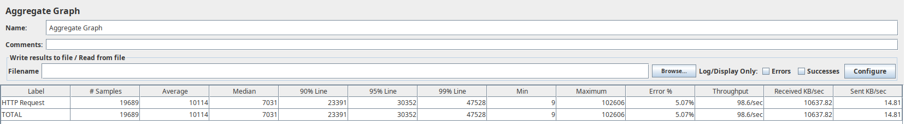
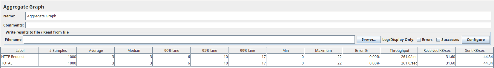
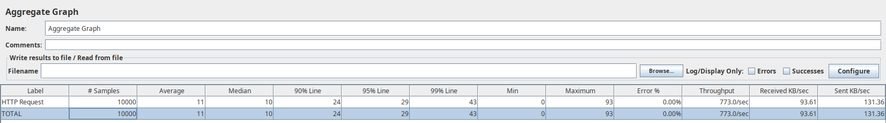
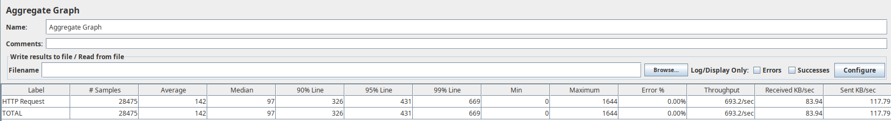
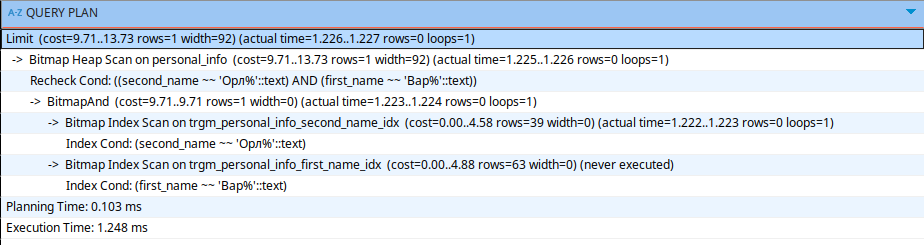

## Task:
 
 - Read from DB accounts by name and surname prefixes(sort by ID)
 - Use Jmeter to create load tests with connection simultaneous 1/10/100/1000 requests

To reduce PC RAM consumprion, retuned amount of users will be set to 1K.
JMetr will have 1K loops
Request for PostgreSQL analyze(the same one used in code):
```sql
explain analyze SELECT
	account_id,
	first_name,
	second_name,
	birth_date,
	biography,
	city
FROM public.personal_info
WHERE first_name LIKE 'Вар%' AND second_name LIKE 'Орл%'
LIMIT 100
```

## Without indexes

#### 1 connection request

 


#### 10 connection simultaneous requests

 


#### 100 connection simultaneous requests

 


#### 1000 connection simultaneous requests

 


#### Query analyze:

 

`Seq Scan` are pretty heavy, because they read all data sequently from table. We could see, that cost is in 10k - 20k range


## With indexes

#### 1 connection request

 


#### 10 connection simultaneous requests

 


#### 100 connection simultaneous requests

 


#### 1000 connection simultaneous requests

 


#### Query analyze:
 

`Bitmap Heap Scan` + `Bitmap Index Scan` are pretty fast and cheap: cost is in 10 - 14 range

## Conclusions

It's obvious that indexes allow to speed up read, that's why results are trivial.

Indexes chose strongly depends on API/business requirements. 
By the task we should have in request Name + Surname suffixes where `gin_trgm` will work well(could be also improved with composite index name + surname with `btree_gist`: `CREATE INDEX ON public.personal_info USING gist (first_name, second_name gist_trgm_ops);`).

But trigrams may not good at searching for patterns consisting of a single character repeated N times (such as `ЮЮЮ`) because there exists only 1 non-terminal trigram and that could have a high occurrence in the search space. For such case index performance could be even worse, than `Seq Scan`, I think that is a corner case for such index, which could be minimized by parameters restrictions(I hope, that there are almost no such names consisting of one repeatable letter)
Whilst also in real life requests will be much more complicated and with typos, that's why special DBs for full text search could work better(accuracy + speed) than PostgreSQL. But it must be proved by benchmarks


## Extra links:
 - JMeter [config](../config/jmeter/search_by_name/test_plan.jmx)
 - Postman [file](../../../configs/postman_collection.json)